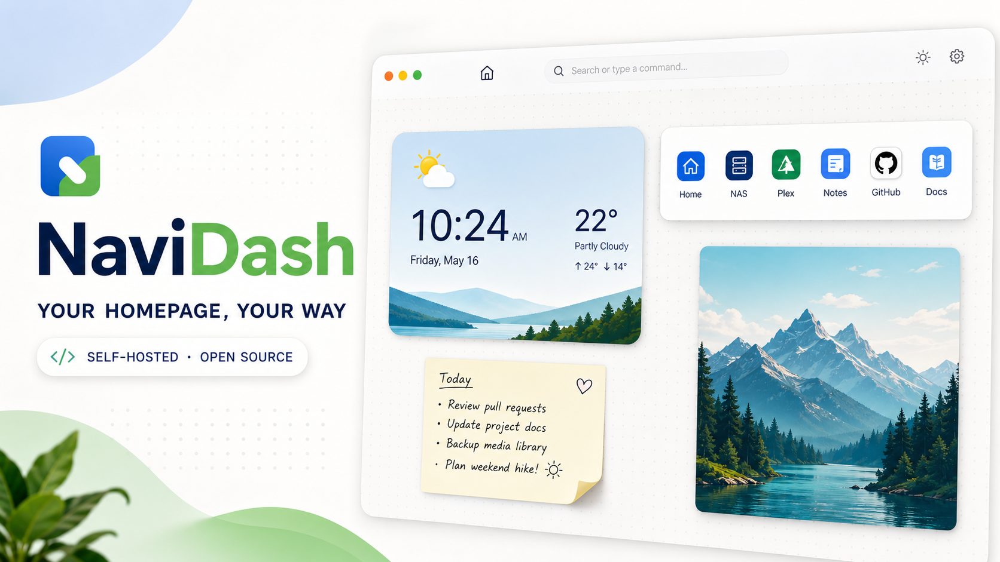

<p align="center">
  
</p>

<h1 align="center">NaviDash</h1>

<p align="center">
  <strong>Your homepage, arranged your way.</strong>
</p>

<p align="center">
  <a href="./README.md">中文</a> · <strong>English</strong>
</p>

<p align="center">
  
  
  
</p>

<p align="center">
  <a href="https://navidash.vercel.app/en"><strong>Try the Demo</strong></a>
  ·
  <a href="./docs/DEPLOY.md">Deploy on your LAN</a>
  ·
  <a href="./docs/USER_GUIDE_EN.md">User Guide</a>
  ·
  <a href="https://t.me/+5iPcqd4_AvE0ZGY0">Telegram Group</a>
</p>

<p align="center">
  
</p>

When you open a browser, you usually need only a few things: visit a familiar site, search for
something, glance at the time, weather, or next race, or keep a temporary note. NaviDash brings them together
in a quiet, flexible homepage that belongs to you.

## Interface preview

<p align="center">
  <a href="https://ibb.co/22gKLBP">
    
  </a>
  <a href="https://ibb.co/nqHhnKBZ">
    
  </a>
</p>

## Why NaviDash

- **One less step**: type a letter and quickly reach the sites you open most.
- **Better with use**: your current browser remembers your habits and brings likely destinations forward.
- **Just enough information**: time, weather, and temporary content stay visible without creating clutter.
- **A space of your own**: arrange links, notes, and posters like objects on a wall, separately on desktop and mobile.
- **Your data, your home**: run NaviDash on your computer, NAS, or server, then back it up whenever you want.

## One wall, six kinds of content

| Content | Purpose |
| --- | --- |
| 🧭 **Frequent destinations** | Keep everyday sites in familiar positions |
| ☀️ **Today at a glance** | See the time, date, and weather quietly |
| 📝 **Sticky note** | Hold temporary text, links, or information for later |
| 🖼️ **Poster** | Use images you love to give the homepage its own atmosphere |
| 🏁 **F1 information** | See the local-time schedule or switch to the latest driver standings |
| 🖥️ **Komari node** | Keep an eye on the live status of your personal servers |

## Quick start

### Docker Compose

```bash
git clone https://github.com/wtfllix/navidash.git
cd navidash
cp .env.example .env
sudo mkdir -p /opt/navidash-data
docker compose up -d
```

Open [http://localhost:3000](http://localhost:3000) on the host. Other devices on the same LAN can
use `http://HOST_LAN_IP:3000`, then add bookmarks and content from the bottom Dock.

See the [deployment guide](./docs/DEPLOY.md) for host IP discovery, firewall checks, weather,
access protection, upgrades, and backups.

### Local development

```bash
npm install
npm run dev
```

### Preview the documentation site locally

```bash
cd docs-site
npm ci
npm run dev
```

The documentation site is published by its own GitHub Pages workflow. On first setup, set the
repository's Settings → Pages source to **GitHub Actions**.

## Project documentation

| Document | Contents |
| --- | --- |
| [Documentation site](https://wtfllix.github.io/navidash/) | Chinese-first deployment, usage, widget, and troubleshooting guides |
| [Deployment and Usage Wiki](./docs/WIKI.md) | Entry point for personal LAN deployment, usage, backups, and troubleshooting |
| [Deployment Guide](./docs/DEPLOY.md) | Docker, LAN access, upgrades, backups, and troubleshooting |
| [User Guide](./docs/USER_GUIDE_EN.md) | Homepage widgets, bookmarks, and everyday use |
| [Changelog](./changelog.md) | Released features and meaningful changes |
| [Chinese README](./README.md) | 中文项目介绍 |

## Typeface and license

The handwritten date in Today uses
[Kaushan Script](https://fonts.google.com/specimen/Kaushan+Script), designed by Impallari Type and
distributed with NaviDash under the SIL Open Font License 1.1. See
[`public/fonts/KaushanScript-LICENSE.txt`](./public/fonts/KaushanScript-LICENSE.txt) for the full
license.

NaviDash is released under the [MIT License](https://opensource.org/license/mit).
